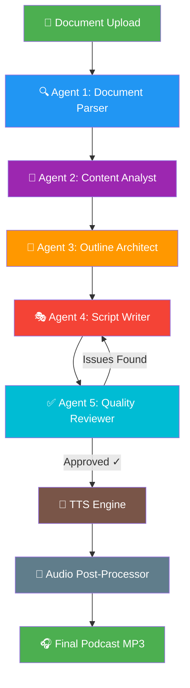

# 🎙️ Doc-to-Podcast — Architecture & Technical Blueprint

> **Transform any document into an engaging, addictive podcast conversation between two hosts**

---

## 📋 Table of Contents

1. [Product Vision](#-product-vision)
2. [System Architecture Overview](#-system-architecture-overview)
3. [Tech Stack](#-tech-stack)
4. [Agent Workflow Pipeline](#-agent-workflow-pipeline)
5. [Detailed Agent Specifications](#-detailed-agent-specifications)
6. [Document Processing Strategy](#-document-processing-strategy)
7. [Script Generation — The Secret Sauce](#-script-generation--the-secret-sauce)
8. [Voice Synthesis Pipeline](#-voice-synthesis-pipeline)
9. [Audio Post-Processing](#-audio-post-processing)
10. [Error Handling & Anti-Hallucination Guardrails](#-error-handling--anti-hallucination-guardrails)
11. [Scalability for Long Documents](#-scalability-for-long-documents)
12. [Project Structure](#-project-structure)
13. [API Keys & Setup](#-api-keys--setup)
14. [Deployment Options](#-deployment-options)

---

## 🎯 Product Vision

| Aspect | Detail |
|---|---|
| **Input** | Any document — PDF, DOCX, PPTX, TXT, HTML, Markdown, CSV, URL (no file size limit) |
| **Output** | High-quality podcast audio (MP3) — a natural, engaging two-person conversation |
| **Hosts** | 1 Male host ("Alex") + 1 Female host ("Maya") |
| **Tone** | Informative yet entertaining — like your favorite podcast duo |
| **Length** | Proportional to document — supports 5-minute quick takes to 2+ hour deep dives |
| **Accuracy** | Zero hallucination — every claim is grounded in the source document |

---

## 🏗️ System Architecture Overview

```
┌─────────────────────────────────────────────────────────────────────────┐
│                        DOC-TO-PODCAST PIPELINE                         │
├─────────────────────────────────────────────────────────────────────────┤
│                                                                         │
│   📄 DOCUMENT        🧠 AI AGENTS           🎤 VOICE           🎧 OUTPUT │
│   ───────────        ──────────────         ─────────          ──────── │
│                                                                         │
│   ┌──────────┐     ┌──────────────┐     ┌──────────┐     ┌──────────┐  │
│   │ Upload   │────▶│ 1. Parser    │────▶│ Edge TTS │────▶│ Final    │  │
│   │ Document │     │    Agent     │     │ (Male)   │     │ Podcast  │  │
│   └──────────┘     └──────┬───────┘     └──────────┘     │ MP3      │  │
│                           │                               │          │  │
│                    ┌──────▼───────┐     ┌──────────┐     │          │  │
│                    │ 2. Analyst   │     │ Edge TTS │────▶│          │  │
│                    │    Agent     │     │ (Female) │     │          │  │
│                    └──────┬───────┘     └──────────┘     └──────────┘  │
│                           │                                            │
│                    ┌──────▼───────┐                                     │
│                    │ 3. Outline   │                                     │
│                    │    Agent     │                                     │
│                    └──────┬───────┘                                     │
│                           │                                            │
│                    ┌──────▼───────┐                                     │
│                    │ 4. Script    │                                     │
│                    │   Writer     │                                     │
│                    └──────┬───────┘                                     │
│                           │                                            │
│                    ┌──────▼───────┐                                     │
│                    │ 5. Reviewer  │                                     │
│                    │    Agent     │                                     │
│                    └──────────────┘                                     │
│                                                                         │
└─────────────────────────────────────────────────────────────────────────┘
```

---

## 🛠️ Tech Stack

### Core Application

| Component | Technology | Why This Choice |
|---|---|---|
| **Language** | Python 3.11+ | Rich ecosystem for AI, TTS, and audio processing |
| **Web Framework** | FastAPI + Jinja2 | Async-first, WebSocket support for real-time progress, fast |
| **Frontend** | HTML + Vanilla CSS + JavaScript | Lightweight, no build step, beautiful with custom CSS |
| **Task Queue** | Celery + Redis | Background processing for long podcast generation |
| **File Storage** | Local filesystem (default) / S3-compatible | No size limits, streaming support |

### AI / LLM Layer

| Component | Technology | Free Tier Details |
|---|---|---|
| **Primary LLM** | **Google Gemini 2.5 Flash** (via `google-genai` SDK) | ✅ Free — 500 req/day, **1M token context window** |
| **Fallback LLM** | **Groq** (Llama 3.3 70B) | ✅ Free — 1000 req/day, 128K context, ultra-fast |
| **Local LLM (optional)** | **Ollama** (Llama 3.3 / Qwen 2.5) | ✅ Free — unlimited, no API dependency |
| **Orchestration** | **LangGraph** (by LangChain) | Agent workflow orchestration with state management |

> [!IMPORTANT]
> **Why Gemini 2.5 Flash?** Its **1 million token context window** is the killer feature. Most documents (even 500+ page books) fit in a single request — no chunking needed, no information loss, no coherence problems. This is the single most important architectural decision.

### Text-to-Speech (TTS)

| Component | Technology | Free Tier Details |
|---|---|---|
| **Primary TTS** | **Edge TTS** (`edge-tts` Python package) | ✅ Free — no API key, no limits, neural voices |
| **Male Voice** | `en-US-GuyNeural` or `en-US-AndrewNeural` | Natural, warm, conversational male voice |
| **Female Voice** | `en-US-AriaNeural` or `en-US-JennyNeural` | Expressive, engaging female voice |
| **Fallback TTS** | **Kokoro TTS** (open-source, 82M params) | ✅ Free — best OSS quality, needs GPU |
| **Backup TTS** | **Piper TTS** (open-source) | ✅ Free — fast, CPU-friendly |

> [!TIP]
> **Edge TTS** is the sweet spot — zero cost, zero API keys, zero rate limits, and Microsoft's neural voices sound remarkably natural. For users with a GPU who want even higher quality, Kokoro TTS is the upgrade path.

### Document Parsing

| Component | Technology | Formats Supported |
|---|---|---|
| **Primary Parser** | **Markitdown** (by Microsoft) | PDF, DOCX, PPTX, Excel, HTML, CSV, JSON, XML, images, audio |
| **PDF Fallback** | **PyMuPDF (fitz)** | Complex PDFs with tables, columns, images |
| **Web Scraping** | **BeautifulSoup4 + httpx** | URLs, web articles |
| **Universal Fallback** | **Unstructured** | 20+ file formats with intelligent chunking |

### Audio Processing

| Component | Technology | Purpose |
|---|---|---|
| **Audio Manipulation** | **PyDub** | Concatenation, crossfading, volume normalization |
| **Format Conversion** | **FFmpeg** (via `ffmpeg-python`) | MP3/WAV/OGG encoding, bitrate control |
| **Audio Effects** | **PyDub + scipy** | EQ, compression, noise reduction |

### Infrastructure

| Component | Technology | Purpose |
|---|---|---|
| **Process Manager** | **Celery** | Background task processing |
| **Message Broker** | **Redis** | Task queue + real-time progress via WebSockets |
| **Database** | **SQLite** (default) / PostgreSQL | Job tracking, history |
| **Caching** | **Redis** | LLM response caching, intermediate results |

---

## 🔄 Agent Workflow Pipeline

The pipeline uses **5 specialized AI agents**, each with a focused responsibility. This separation ensures quality, accuracy, and engaging output.



### Pipeline Execution Flow

```
Step 1 │ Document Parser Agent
       │ ├── Parse document (any format) to clean text
       │ ├── Extract metadata (title, author, sections)
       │ ├── Identify structure (chapters, headings, key sections)
       │ └── Output: Structured text + metadata JSON
       │
Step 2 │ Content Analyst Agent
       │ ├── Identify key themes, topics, and insights
       │ ├── Extract fascinating facts, statistics, quotes
       │ ├── Rate topics by "engagement potential" (1-10)
       │ ├── Flag complex concepts needing simplification
       │ └── Output: Content analysis report (JSON)
       │
Step 3 │ Outline Architect Agent
       │ ├── Design podcast episode structure
       │ ├── Plan topic flow with narrative arc
       │ ├── Design hook opening & satisfying conclusion
       │ ├── Plan transitions, callbacks, and cliffhangers
       │ ├── Estimate timing for each segment
       │ └── Output: Detailed episode outline (JSON)
       │
Step 4 │ Script Writer Agent
       │ ├── Write full two-person conversational script
       │ ├── Apply engagement techniques (see Section 7)
       │ ├── Include SSML tags for voice expression
       │ ├── Generate segment-by-segment (for long episodes)
       │ └── Output: Complete podcast script (structured JSON)
       │
Step 5 │ Quality Reviewer Agent
       │ ├── Fact-check every claim against source document
       │ ├── Check for hallucinations (reject if found)
       │ ├── Verify natural conversation flow
       │ ├── Ensure engagement quality
       │ ├── Validate SSML tags
       │ └── Output: Approved script OR revision requests
       │
Step 6 │ TTS Synthesis
       │ ├── Process each dialogue line with appropriate voice
       │ ├── Apply SSML for expression and pacing
       │ ├── Generate individual audio segments
       │ └── Output: Individual audio clips per line
       │
Step 7 │ Audio Post-Processor
       │ ├── Concatenate all clips in sequence
       │ ├── Add natural pauses between speakers (200-500ms)
       │ ├── Apply crossfading at transitions
       │ ├── Normalize volume levels
       │ ├── Add optional intro/outro music
       │ └── Output: Final podcast MP3 file
```

---

## 🤖 Detailed Agent Specifications

### Agent 1: Document Parser

```yaml
Name: DocumentParserAgent
Role: Extract and structure text from any uploaded document
LLM: None (deterministic processing — no LLM needed)
Libraries:
  - markitdown (primary)
  - PyMuPDF (PDF fallback)
  - python-docx (DOCX fallback)
  - BeautifulSoup4 (HTML/URL)
  
Input: Raw uploaded file (any format)
Output:
  structured_text: str          # Clean extracted text
  metadata:
    title: str                  # Document title
    author: str                 # Author if available
    page_count: int             # Number of pages
    word_count: int             # Total word count
    sections: list[str]         # Identified section headings
    estimated_read_time: int    # Minutes to read
  
Error Handling:
  - Retry with fallback parser if primary fails
  - OCR fallback for scanned PDFs (via pytesseract)
  - Encoding detection for text files (via chardet)
  - Maximum 3 parser attempts before reporting failure
```

### Agent 2: Content Analyst

```yaml
Name: ContentAnalystAgent
Role: Deep analysis of document content for podcast potential
LLM: Gemini 2.5 Flash (1M context)

System Prompt: |
  You are an expert content analyst preparing material for an engaging 
  podcast. Analyze the provided document and extract:
  
  1. KEY THEMES: The 3-7 major themes or topics
  2. FASCINATING FACTS: Surprising statistics, counterintuitive findings,
     or little-known facts that would make great podcast moments
  3. COMPLEX CONCEPTS: Ideas that need simplification with analogies
  4. QUOTABLE MOMENTS: Powerful quotes or statements worth reading aloud
  5. CONTROVERSY/DEBATE: Points where reasonable people might disagree
  6. HUMAN STORIES: Personal anecdotes, case studies, or examples
  7. ENGAGEMENT SCORE: Rate each topic 1-10 for listener interest
  
  CRITICAL: Only extract information that EXISTS in the document. 
  Do NOT add any information not present in the source material.
  For each extracted item, include the source reference (page/section).

Input: Structured text + metadata from Agent 1
Output:
  themes: list[Theme]
  fascinating_facts: list[Fact]
  complex_concepts: list[Concept]
  quotable_moments: list[Quote]
  debate_points: list[DebatePoint]
  human_stories: list[Story]
  overall_engagement_potential: float  # 1-10
  recommended_podcast_length: str     # "short" | "medium" | "long" | "deep-dive"
```

### Agent 3: Outline Architect

```yaml
Name: OutlineArchitectAgent
Role: Design the podcast episode structure for maximum engagement
LLM: Gemini 2.5 Flash

System Prompt: |
  You are a master podcast producer who designs episode structures that 
  keep listeners hooked from start to finish. Using the content analysis 
  provided, create a detailed episode outline following these principles:
  
  STRUCTURE RULES:
  1. COLD OPEN (30s): Start with the most surprising fact or provocative 
     question — hook them in 10 seconds
  2. INTRO (1-2min): Hosts introduce themselves and the topic with energy
  3. ACT 1 - FOUNDATION (20%): Set the stage, establish context
  4. ACT 2 - DEEP DIVE (50%): Explore key topics with building complexity
  5. ACT 3 - SYNTHESIS (20%): Connect the dots, reveal bigger picture
  6. CONCLUSION (10%): Key takeaways, "mind-blown" moment, sign-off
  
  ENGAGEMENT TECHNIQUES to plan for:
  - Cliffhangers before topic transitions
  - Planned disagreements between hosts
  - "Pop quiz" moments where one host tests the other
  - Callback references to earlier points
  - Listener-directed moments
  
  PACING RULES:
  - Alternate between heavy and light segments
  - No single topic longer than 5 minutes without a shift
  - Include at least one "breather" moment with humor per 10 minutes
  - Build to a crescendo before the conclusion

Input: Content analysis from Agent 2
Output:
  episode_title: str
  estimated_duration_minutes: int
  segments: list[Segment]
    - segment_id: int
    - title: str
    - description: str
    - topics: list[str]
    - engagement_technique: str
    - estimated_duration: str
    - energy_level: str  # "low" | "medium" | "high" | "climax"
    - transition_hook: str  # How to tease the next segment
```

### Agent 4: Script Writer

```yaml
Name: ScriptWriterAgent
Role: Write the full conversational podcast script
LLM: Gemini 2.5 Flash (primary) / Groq Llama 3.3 70B (fallback)

System Prompt: |
  You are a world-class podcast script writer. You write scripts for 
  a two-host podcast that sounds like a natural, unscripted conversation 
  between two brilliant friends who happen to be experts.
  
  THE HOSTS:
  - ALEX (Male): Enthusiastic, analytical, loves diving deep into details.
    Uses analogies to explain complex ideas. Occasionally nerdy humor.
    Voice: Warm, energetic, tends to speed up when excited.
    
  - MAYA (Female): Curious, insightful, great at asking the questions 
    listeners are thinking. Connects ideas to real-world implications. 
    Sharp wit. Voice: Engaging, expressive, uses dramatic pauses.
  
  WRITING RULES:
  1. Write EXACTLY how people talk — contractions, fragments, interruptions
  2. Include natural reactions: "Wait, really?", "No way!", "That's wild"
  3. Include thinking sounds: "Hmm...", "So basically...", "Right, right"
  4. Hosts should build on each other's points, not just take turns
  5. Include genuine moments of discovery and surprise
  6. Use the Socratic method — questions that lead to deeper understanding
  7. Add humor naturally — don't force it
  8. Include brief personal anecdotes or hypothetical scenarios
  9. NEVER make up facts not in the source document
  10. Include SSML tags for expressive speech
  
  SSML TAGS TO USE:
  - <break time="500ms"/> for dramatic pauses
  - <emphasis level="strong">word</emphasis> for emphasis
  - <prosody rate="fast">text</prosody> for excited speech
  - <prosody rate="slow">text</prosody> for thoughtful moments
  
  OUTPUT FORMAT:
  Return a JSON array of dialogue objects:
  {
    "speaker": "ALEX" | "MAYA",
    "text": "The dialogue text with SSML tags",
    "emotion": "excited" | "curious" | "thoughtful" | "amused" | 
               "surprised" | "serious",
    "segment_id": 1
  }

Input: Episode outline from Agent 3 + Original document text
Output:
  script: list[DialogueLine]
  total_lines: int
  estimated_audio_duration: str
```

### Agent 5: Quality Reviewer

```yaml
Name: QualityReviewerAgent
Role: Fact-check, verify quality, and approve the final script
LLM: Gemini 2.5 Flash

System Prompt: |
  You are a meticulous quality reviewer for a podcast production team. 
  Your job is to ensure the script is:
  
  1. FACTUALLY ACCURATE: Every claim, statistic, and statement must be 
     traceable to the source document. Flag ANY information that appears 
     to be hallucinated or embellished beyond what the source states.
  
  2. NATURALLY CONVERSATIONAL: The dialogue should sound like real people 
     talking, not robots reading scripts. Flag stiff or unnatural lines.
  
  3. ENGAGING: The conversation should maintain listener interest throughout.
     Flag any segments that feel boring, repetitive, or draggy.
  
  4. COHERENT: Topics should flow logically. No abrupt jumps or 
     contradictions.
  
  5. BALANCED: Both hosts should have roughly equal speaking time and both 
     should contribute meaningfully.
  
  REVIEW OUTPUT:
  - approved: boolean
  - issues: list of specific problems with line numbers
  - hallucination_flags: list of claims not found in source
  - suggestions: list of improvement suggestions
  - quality_scores:
      factual_accuracy: float (0-10)
      naturalness: float (0-10)
      engagement: float (0-10)
      coherence: float (0-10)
  
  THRESHOLD: Script is approved only if ALL scores >= 7.0 and 
  hallucination_flags is empty.

Input: Complete script from Agent 4 + Original document text
Output:
  approved: bool
  review_report: ReviewReport
  revised_script: list[DialogueLine] | null  # If minor fixes were made
```

---

## 📄 Document Processing Strategy

### Multi-Format Support

```python
SUPPORTED_FORMATS = {
    # Document formats
    ".pdf":  "markitdown -> PyMuPDF fallback",
    ".docx": "markitdown -> python-docx fallback",
    ".doc":  "markitdown -> antiword fallback",
    ".pptx": "markitdown -> python-pptx fallback",
    ".txt":  "direct read with encoding detection",
    ".md":   "direct read",
    ".rtf":  "markitdown",
    
    # Data formats
    ".csv":  "markitdown -> pandas",
    ".xlsx": "markitdown -> openpyxl",
    ".json": "markitdown -> json parse",
    ".xml":  "markitdown -> lxml",
    
    # Web
    ".html": "markitdown -> BeautifulSoup4",
    "url":   "httpx + BeautifulSoup4 -> markitdown",
}
```

### Large File Strategy

```
┌────────────────────────────────────────────────────┐
│           DOCUMENT SIZE DECISION TREE               │
├────────────────────────────────────────────────────┤
│                                                    │
│  Document ──▶ Extract Text ──▶ Count Tokens        │
│                                                    │
│  IF tokens < 800,000 (fits in Gemini context):     │
│  └──▶ Process ENTIRE document in ONE request       │
│       (No chunking needed — best quality)          │
│                                                    │
│  IF tokens 800,000 - 2,000,000:                    │
│  └──▶ Hierarchical processing:                     │
│       ├── Split into logical sections              │
│       ├── Analyze each section separately          │
│       ├── Create master analysis from summaries    │
│       └── Generate script from master analysis     │
│                                                    │
│  IF tokens > 2,000,000 (very rare):                │
│  └──▶ Map-Reduce strategy:                         │
│       ├── Map: Extract key content per chunk       │
│       ├── Reduce: Consolidate & prioritize         │
│       └── Generate script from consolidated view   │
│                                                    │
└────────────────────────────────────────────────────┘
```

> [!NOTE]
> With Gemini's 1M token context window, most documents (even 500+ page books) fit in a single request. Chunking is only needed for exceptionally large documents, which is rare. This eliminates the #1 source of quality degradation in competing solutions.

---

## 🎭 Script Generation — The Secret Sauce

### What Makes the Podcast Addictive

The script generation is the heart of the application. Here's the formula for creating genuinely engaging content:

#### 1. The Hook Pattern
```
COLD OPEN: Start with the most mind-blowing fact from the document
Example: "Did you know that [surprising fact]? Well, today we're going 
to unpack exactly how that works, and honestly, it's even more 
fascinating than it sounds..."
```

#### 2. The Tension-Release Cycle
```
Every 3-5 minutes:
  1. TENSION: Introduce a complex idea, problem, or question
  2. EXPLORATION: Hosts discuss, debate, use analogies
  3. RELEASE: "Aha!" moment — the insight clicks
  4. BRIDGE: "But that's not even the best part..." -> next cycle
```

#### 3. Character-Driven Dynamics
```
ALEX's personality moves:
  - "Okay, let me break this down with an analogy..."
  - "This is where it gets nerdy, but bear with me..."
  - "Fun fact that's slightly tangential but too good not to share..."

MAYA's personality moves:
  - "Wait, hold on — so you're saying that [reframes for clarity]?"
  - "This reminds me of [connects to broader context]..."
  - "Okay but what does this actually MEAN for [real-world impact]?"

DYNAMIC MOMENTS:
  - Friendly disagreements: "I actually see it differently..."
  - Surprise: "I did NOT know that. Seriously?"
  - Humor: Natural reactions and observations
  - Teaching: One explains to the other (and thus to the listener)
```

#### 4. Pacing Map
```
TIME        ENERGY    CONTENT TYPE
─────────────────────────────────────────────
0:00-0:30   🔥 HIGH   Cold open — hook
0:30-2:00   ⬆️ RISING  Intro & topic overview
2:00-8:00   📊 MEDIUM  Foundation — context setting
8:00-10:00  😄 LIGHT   Breather — humor/anecdote
10:00-20:00 📈 RISING  Deep dive — building complexity
20:00-22:00 😄 LIGHT   Breather — real-world example
22:00-30:00 🔥 HIGH    Key insights — "aha" moments
30:00-35:00 🎯 CLIMAX  Biggest revelation
35:00-40:00 🧘 COOL    Synthesis & takeaways
40:00-42:00 💫 WARM    Sign-off & tease
```

---

## 🎤 Voice Synthesis Pipeline

### Edge TTS Configuration

```python
# Voice Configuration
VOICES = {
    "ALEX": {
        "voice_id": "en-US-AndrewNeural",      # Warm, conversational male
        "fallback": "en-US-GuyNeural",           # Alternative male voice
        "rate": "+0%",                            # Normal speaking rate
        "pitch": "+0Hz",                          # Normal pitch
    },
    "MAYA": {
        "voice_id": "en-US-AriaNeural",          # Expressive, engaging female
        "fallback": "en-US-JennyNeural",         # Alternative female voice
        "rate": "+0%",
        "pitch": "+0Hz",
    }
}

# Emotion-to-SSML Mapping
EMOTION_MODIFIERS = {
    "excited":    {"rate": "+15%", "pitch": "+5Hz"},
    "curious":    {"rate": "-5%",  "pitch": "+3Hz"},
    "thoughtful": {"rate": "-10%", "pitch": "-2Hz"},
    "amused":     {"rate": "+5%",  "pitch": "+2Hz"},
    "surprised":  {"rate": "+10%", "pitch": "+8Hz"},
    "serious":    {"rate": "-8%",  "pitch": "-3Hz"},
}
```

### TTS Processing Pipeline

```
For each dialogue line in script:
│
├── 1. Select voice (ALEX -> AndrewNeural, MAYA -> AriaNeural)
├── 2. Apply emotion modifiers (rate, pitch adjustments)
├── 3. Process SSML tags (emphasis, breaks, prosody)
├── 4. Call Edge TTS API
│     └── edge-tts --voice {voice_id} --rate {rate} --pitch {pitch}
│         --text "{text}" --write-media {output_path}
├── 5. Save individual audio clip (.mp3)
├── 6. Log duration and metadata
└── 7. If TTS fails -> retry 3x -> fallback to alternate voice -> Piper TTS
```

### Parallel TTS Processing

```python
# Process TTS in parallel batches for speed
BATCH_SIZE = 10  # Process 10 lines concurrently
MAX_CONCURRENT = 5  # Max concurrent Edge TTS connections

# Pipeline:
# 1. Split script into batches of 10 lines
# 2. Process each batch with asyncio.gather()
# 3. Each line generates an individual .mp3 file
# 4. Collect all files in order for stitching
```

---

## 🎵 Audio Post-Processing

### Stitching Pipeline

```python
AUDIO_CONFIG = {
    # Inter-speaker pause (silence between different speakers)
    "speaker_pause_ms": 350,        # 350ms pause between speakers
    
    # Same-speaker continuation pause  
    "continuation_pause_ms": 150,    # 150ms for same speaker continuing
    
    # Crossfade duration
    "crossfade_ms": 50,              # 50ms crossfade for smoothness
    
    # Volume normalization target
    "target_dbfs": -16.0,            # Broadcast standard loudness
    
    # Output format
    "output_format": "mp3",
    "output_bitrate": "192k",        # High quality
    "sample_rate": 44100,            # CD quality
    
    # Optional: Background music
    "intro_music": "assets/intro.mp3",        # 5-second intro jingle
    "outro_music": "assets/outro.mp3",        # 5-second outro jingle
    "bg_music": "assets/ambient.mp3",         # Subtle ambient (optional)
    "bg_music_volume_db": -30,                # Very quiet background
}
```

### Post-Processing Steps

```
1. COLLECT     │ Gather all individual audio clips in script order
2. NORMALIZE   │ Adjust each clip to target loudness (-16 dBFS)
3. ADD PAUSES  │ Insert appropriate silence between clips
4. CROSSFADE   │ Apply 50ms crossfade at boundaries
5. STITCH      │ Concatenate all processed clips
6. ADD MUSIC   │ Overlay intro/outro music (optional)
7. MASTER      │ Final loudness normalization on complete file
8. ENCODE      │ Export as MP3 @ 192kbps, 44.1kHz
9. METADATA    │ Add ID3 tags (title, artist, duration)
```

---

## 🛡️ Error Handling & Anti-Hallucination Guardrails

### Anti-Hallucination Strategy

This is critical. The system uses **4 layers of defense** against hallucination:

```
LAYER 1: PROMPT ENGINEERING
├── Every agent prompt explicitly says "ONLY use information from the source document"
├── Require source references (page/section) for every claim
└── Include examples of what hallucination looks like

LAYER 2: GROUNDED GENERATION
├── Content Analyst only extracts — never invents
├── Script Writer receives the extraction, not free reign
└── All facts are pre-verified in the analysis phase

LAYER 3: AUTOMATED REVIEW
├── Quality Reviewer cross-references EVERY claim against source
├── Uses separate LLM call to verify (not same context)
├── Any unverifiable claim -> automatic rejection
└── Script cannot pass review with hallucination score > 0

LAYER 4: HUMAN-READABLE AUDIT
├── Generate a "fact-check report" alongside the podcast
├── Each claim mapped to source document location
└── User can verify any statement
```

### Error Recovery

```
DOCUMENT PARSING ERRORS
├── Primary parser fails -> Try fallback parser
├── All parsers fail -> OCR attempt (pytesseract)
├── OCR fails -> Return clear error with supported format list
└── Encoding issues -> chardet detection + retry

LLM API ERRORS  
├── Gemini rate limit -> Wait + exponential backoff (max 3 retries)
├── Gemini quota exceeded -> Fallback to Groq API
├── Groq rate limit -> Wait + backoff
├── All APIs fail -> Queue for retry, notify user
└── Context too large -> Trigger chunking pipeline

TTS ERRORS
├── Edge TTS timeout -> Retry with same voice (3 attempts)
├── Edge TTS throttled -> Short delay + retry
├── Voice not available -> Use fallback voice
├── All Edge TTS fails -> Fallback to Piper TTS
└── Audio corruption -> Re-generate affected clips

AUDIO PROCESSING ERRORS
├── FFmpeg not found -> Attempt auto-install, prompt user
├── Clip corruption -> Re-generate from TTS
├── Memory issues (very long podcasts) -> Stream-based processing
└── Disk space -> Check before starting, warn early
```

---

## 📏 Scalability for Long Documents

### Podcast Length Scaling

| Document Size | Est. Podcast Length | Strategy |
|---|---|---|
| 1-5 pages | 5-10 min | Single-pass, highlight key points |
| 5-20 pages | 10-25 min | Single-pass, deeper exploration |
| 20-50 pages | 25-45 min | Single-pass, selective deep dives |
| 50-100 pages | 45-75 min | Full coverage with curated depth |
| 100-300 pages | 75-120 min | Prioritized coverage, multi-act structure |
| 300+ pages | 120+ min (multi-episode option) | Chapter-based episodes or curated single episode |

### Memory-Efficient Processing for Very Long Podcasts

```python
# For podcasts > 60 minutes, use streaming approach:

# 1. Generate script in segments (by outline section)
# 2. TTS each segment immediately (don't hold all in memory)
# 3. Write each segment's audio to disk as generated
# 4. Final step: stream-stitch from disk (not memory)

# This means even a 3-hour podcast uses ~constant memory
```

### Multi-Episode Support

```
For documents that would produce > 2 hours of content:

OPTION A: Single Deep-Dive Episode
  - Curate the most important/interesting content
  - Create a comprehensive but focused episode

OPTION B: Multi-Episode Series (user choice)
  - Split document into logical parts (chapters, themes)
  - Generate a series of 30-45 minute episodes
  - Each episode has its own arc but references the series
  - Include "Previously on..." recaps
```

---

## 📁 Project Structure

```
doc-to-podcast/
├── app/
│   ├── __init__.py
│   ├── main.py                    # FastAPI application entry point
│   ├── config.py                  # Configuration & environment variables
│   ├── models.py                  # Pydantic models (request/response schemas)
│   │
│   ├── api/
│   │   ├── __init__.py
│   │   ├── routes.py              # API endpoints (upload, status, download)
│   │   └── websocket.py           # WebSocket for real-time progress
│   │
│   ├── agents/
│   │   ├── __init__.py
│   │   ├── base_agent.py          # Base agent class with retry logic
│   │   ├── parser_agent.py        # Agent 1: Document Parser
│   │   ├── analyst_agent.py       # Agent 2: Content Analyst
│   │   ├── outline_agent.py       # Agent 3: Outline Architect
│   │   ├── writer_agent.py        # Agent 4: Script Writer
│   │   ├── reviewer_agent.py      # Agent 5: Quality Reviewer
│   │   └── orchestrator.py        # Pipeline orchestrator (LangGraph)
│   │
│   ├── parsers/
│   │   ├── __init__.py
│   │   ├── document_parser.py     # Multi-format document parser
│   │   ├── pdf_parser.py          # PDF-specific handling
│   │   ├── web_parser.py          # URL/HTML parsing
│   │   └── utils.py               # Text cleaning, encoding detection
│   │
│   ├── tts/
│   │   ├── __init__.py
│   │   ├── tts_engine.py          # TTS abstraction layer
│   │   ├── edge_tts_provider.py   # Edge TTS implementation
│   │   ├── kokoro_provider.py     # Kokoro TTS implementation (optional)
│   │   ├── piper_provider.py      # Piper TTS fallback
│   │   └── ssml_processor.py      # SSML tag handling
│   │
│   ├── audio/
│   │   ├── __init__.py
│   │   ├── processor.py           # Audio stitching & post-processing
│   │   ├── normalizer.py          # Volume normalization
│   │   └── effects.py             # Crossfading, music overlay
│   │
│   ├── llm/
│   │   ├── __init__.py
│   │   ├── provider.py            # LLM provider abstraction
│   │   ├── gemini_provider.py     # Google Gemini integration
│   │   ├── groq_provider.py       # Groq fallback
│   │   └── prompts/
│   │       ├── analyst.txt        # Content Analyst system prompt
│   │       ├── outline.txt        # Outline Architect system prompt
│   │       ├── writer.txt         # Script Writer system prompt
│   │       └── reviewer.txt       # Quality Reviewer system prompt
│   │
│   ├── tasks/
│   │   ├── __init__.py
│   │   └── podcast_task.py        # Celery task for background processing
│   │
│   └── templates/
│       ├── index.html             # Upload page
│       ├── status.html            # Processing status page
│       └── download.html          # Download page
│
├── static/
│   ├── css/
│   │   └── style.css              # Application styles
│   ├── js/
│   │   └── app.js                 # Frontend JavaScript
│   └── assets/
│       ├── intro.mp3              # Intro music (royalty-free)
│       └── outro.mp3              # Outro music (royalty-free)
│
├── tests/
│   ├── test_parser.py
│   ├── test_agents.py
│   ├── test_tts.py
│   └── test_audio.py
│
├── uploads/                       # Uploaded documents (gitignored)
├── output/                        # Generated podcasts (gitignored)
├── temp/                          # Temporary audio clips (gitignored)
│
├── .env.example                   # Environment variable template
├── .gitignore
├── requirements.txt               # Python dependencies
├── pyproject.toml                 # Project metadata
├── docker-compose.yml             # Docker setup (app + Redis)
├── Dockerfile
└── README.md                      # User-facing documentation
```

---

## 🔑 API Keys & Setup

### Required (All Free)

```bash
# .env file

# Google Gemini API (FREE — get at https://ai.google.dev)
GEMINI_API_KEY=your_gemini_api_key_here

# Groq API (FREE — get at https://console.groq.com)  
GROQ_API_KEY=your_groq_api_key_here
```

### Optional

```bash
# Optional: Ollama for local LLM (no key needed)
OLLAMA_BASE_URL=http://localhost:11434

# Optional: Redis for task queue (default: localhost:6379)
REDIS_URL=redis://localhost:6379/0

# Optional: Custom voice selection
MALE_VOICE=en-US-AndrewNeural
FEMALE_VOICE=en-US-AriaNeural

# Optional: Podcast settings
MAX_PODCAST_LENGTH_MINUTES=120
DEFAULT_PODCAST_STYLE=engaging     # engaging | academic | casual
```

### Setup Commands

```bash
# 1. Clone and setup
git clone <your-repo>
cd doc-to-podcast

# 2. Create virtual environment
python -m venv venv
source venv/bin/activate  # Linux/Mac
# or: venv\Scripts\activate  # Windows

# 3. Install dependencies
pip install -r requirements.txt

# 4. Install FFmpeg (required for audio processing)
# Windows: winget install ffmpeg
# macOS:   brew install ffmpeg
# Linux:   sudo apt install ffmpeg

# 5. Copy and configure environment variables
cp .env.example .env
# Edit .env with your API keys

# 6. Run the application
uvicorn app.main:app --reload --host 0.0.0.0 --port 8000
```

---

## 🚀 Deployment Options

### Option 1: Local Development (Simplest)

```bash
# No Redis needed — uses in-process task handling
uvicorn app.main:app --reload --port 8000
```

### Option 2: Docker Compose (Recommended for Production)

```yaml
# docker-compose.yml
version: '3.8'
services:
  app:
    build: .
    ports:
      - "8000:8000"
    environment:
      - GEMINI_API_KEY=${GEMINI_API_KEY}
      - GROQ_API_KEY=${GROQ_API_KEY}
      - REDIS_URL=redis://redis:6379/0
    volumes:
      - ./uploads:/app/uploads
      - ./output:/app/output
    depends_on:
      - redis

  redis:
    image: redis:7-alpine
    ports:
      - "6379:6379"

  worker:
    build: .
    command: celery -A app.tasks worker --loglevel=info
    environment:
      - GEMINI_API_KEY=${GEMINI_API_KEY}
      - GROQ_API_KEY=${GROQ_API_KEY}
      - REDIS_URL=redis://redis:6379/0
    volumes:
      - ./uploads:/app/uploads
      - ./output:/app/output
    depends_on:
      - redis
```

### Option 3: Cloud Deployment (Free Tier)

| Platform | Free Tier | Suitable? |
|---|---|---|
| **Railway** | $5/month credit | ✅ Great for hobby projects |
| **Render** | Free web service (spins down) | ⚠️ Okay for demos |
| **Fly.io** | 3 shared VMs free | ✅ Good for production |
| **Google Cloud Run** | 2M requests/month free | ✅ Excellent with Gemini |

---

## 📊 Dependencies (requirements.txt)

```txt
# Web Framework
fastapi>=0.115.0
uvicorn[standard]>=0.30.0
jinja2>=3.1.0
python-multipart>=0.0.9
websockets>=12.0

# LLM Providers
google-genai>=1.0.0            # Gemini API (official SDK)
groq>=0.9.0                     # Groq API
langchain>=0.3.0                # Agent orchestration
langgraph>=0.2.0                # Workflow graphs

# Document Parsing
markitdown>=0.3.0               # Multi-format document parser (Microsoft)
PyMuPDF>=1.24.0                 # PDF parsing fallback
python-docx>=1.1.0              # DOCX parsing
python-pptx>=0.6.23             # PPTX parsing
beautifulsoup4>=4.12.0          # HTML parsing
httpx>=0.27.0                   # HTTP client for URLs
chardet>=5.2.0                  # Encoding detection

# Text-to-Speech
edge-tts>=6.1.0                 # Microsoft Edge TTS (free, no API key)

# Audio Processing
pydub>=0.25.1                   # Audio manipulation
ffmpeg-python>=0.2.0            # FFmpeg wrapper

# Task Queue (optional — for production)
celery>=5.4.0
redis>=5.0.0

# Utilities
python-dotenv>=1.0.0            # Environment variables
pydantic>=2.0.0                 # Data validation
tiktoken>=0.7.0                 # Token counting
tenacity>=8.2.0                 # Retry logic
loguru>=0.7.0                   # Logging
tqdm>=4.66.0                    # Progress bars
```

---

## 🎯 Summary

| Decision | Choice | Rationale |
|---|---|---|
| **LLM** | Gemini 2.5 Flash (free) | 1M token context = no chunking = best quality |
| **TTS** | Edge TTS (free) | Zero cost, zero API keys, neural quality voices |
| **Parser** | Markitdown + PyMuPDF | Multi-format support, reliable extraction |
| **Audio** | PyDub + FFmpeg | Industry standard, full control |
| **Backend** | FastAPI + Celery | Async, WebSocket progress, background tasks |
| **Agents** | 5-agent pipeline | Separation of concerns, quality at every step |
| **Anti-hallucination** | 4-layer defense | Grounding, verification, automated review, audit trail |

> [!CAUTION]
> **This architecture is designed to produce podcasts that are genuinely engaging and factually accurate.** The 5-agent pipeline with a dedicated Quality Reviewer ensures that no hallucinated content reaches the listener. The engagement techniques (hook patterns, tension-release cycles, character dynamics) are borrowed from professional podcast production.

---

*Built with ❤️ — Making knowledge accessible, one podcast at a time.*
