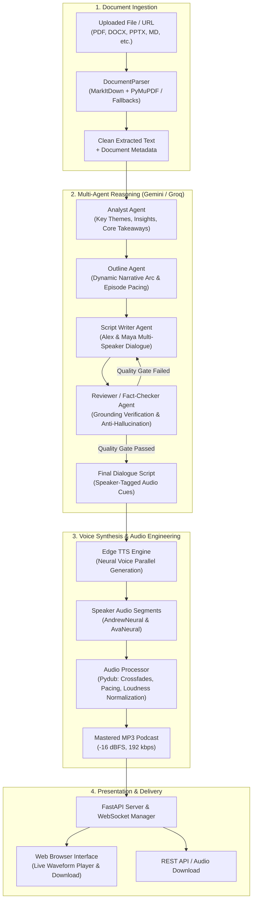

# 🎙️ Doc-to-Podcast

<div align="center">

[](https://www.python.org/)
[](https://fastapi.tiangolo.com/)
[](https://ai.google.dev/)
[](https://groq.com/)
[](https://github.com/rany2/edge-tts)
[](https://opensource.org/licenses/MIT)

**Transform any document into an engaging, multi-speaker conversational podcast between two AI hosts.**

[Key Features](#-key-features) •
[Architecture](#-system-architecture) •
[Quick Start](#-quick-start) •
[API Reference](#-api-reference) •
[Configuration](#-configuration) •
[Contributing](#-contributing)

</div>

---

## 🌟 Overview

**Doc-to-Podcast** takes complex documents—research papers, technical manuals, reports, articles, slides, and web pages—and converts them into natural, high-fidelity conversational audio podcasts.

Instead of a monotone single-voice reading, Doc-to-Podcast simulates an authentic studio conversation between two distinct podcast hosts:
- **Alex (Male Host)**: Analytical, inquisitive, frames key concepts, and asks the probing questions the listener is thinking.
- **Maya (Female Host)**: Enthusiastic, connects real-world analogies, dives into technical nuances, and explains takeaways clearly.

The pipeline combines a **5-stage multi-agent LLM workflow** with zero-cost Edge TTS synthesis and audio post-processing (smart pauses, speaker crossfades, and LUFS loudness normalization) for broadcast-quality audio.

---

## ✨ Key Features

- 📑 **Comprehensive Format Support**: Seamlessly parses PDF, DOCX, DOC, PPTX, TXT, Markdown, HTML, RTF, CSV, XLSX, JSON, and XML.
- 🤖 **5-Agent Collaborative Pipeline**:
  1. **Parser Agent**: Extracts, cleans, and sanitizes document contents with robust fallback strategies.
  2. **Analyst Agent**: Identifies core arguments, counter-arguments, key takeaways, and intriguing anecdotes.
  3. **Outline Agent**: Structures the episode arc with dynamic intros, thematic acts, seamless segues, and conclusions.
  4. **Script Writer Agent**: Crafts lively, realistic dialogue with banter, natural speech markers, interruptions, and questions.
  5. **Reviewer Agent**: Audits script against the source document to eliminate hallucinations and calibrate pacing.
- ⚡ **Zero-Cost / Free-Tier Friendly**:
  - Primary LLM: **Google Gemini 2.5 Flash** (1M token context, generous free tier).
  - Fallback LLM: **Groq Llama 3.3 70B Versatile** (ultra-fast inference, free tier).
  - Voice Engine: **Microsoft Edge TTS** (natural neural voices, 100% free, no API keys needed).
- 🎛️ **Studio-Grade Audio Mastering**:
  - Dynamic crossfading and inter-speaker silence modeling.
  - Normalization to -16 dBFS / LUFS broadcast loudness standard.
  - High-quality 192 kbps MP3 output.
- 📡 **Real-Time Live Updates**: WebSocket-based event streaming provides instant stage updates directly on the web interface.
- 💻 **Modern Web UI & Clean REST API**: Responsive browser dashboard for document upload, real-time status tracking, waveform-ready audio playback, and script inspection.

---

## 🏗️ System Architecture



---

## 👥 Multi-Agent Breakdown

| Agent | Responsibility | Core Objective |
|---|---|---|
| **Parser Agent** | Multi-engine document extraction | Extracts clean structured text across 13+ formats, stripped of boilerplate |
| **Analyst Agent** | Semantic analysis & topic extraction | Identifies high-impact insights, analogies, and questions listeners want answered |
| **Outline Agent** | Episode structuring | Builds a 4-part narrative arc (Hook $\rightarrow$ Deep Dive $\rightarrow$ Debate/Context $\rightarrow$ Takeaways) |
| **Writer Agent** | Script generation | Produces witty, conversational dialogue between Alex & Maya with realistic conversational dynamics |
| **Reviewer Agent** | Factual grounding & verification | Scores script against raw document, prevents hallucinations, checks tone and pacing |

---

## 📁 Repository Structure

```
doc-to-podcast/
├── app/
│   ├── agents/                     # Multi-agent implementations
│   │   ├── base_agent.py           # Abstract base agent class
│   │   ├── parser_agent.py         # Ingestion & sanitization agent
│   │   ├── analyst_agent.py        # Content extraction & theme analyzer
│   │   ├── outline_agent.py        # Narrative arc & episode structuring
│   │   ├── writer_agent.py         # Script dialogue generation
│   │   ├── reviewer_agent.py       # Grounding & anti-hallucination verification
│   │   └── orchestrator.py         # Pipeline coordination & state machine
│   ├── api/                        # API routes and WebSocket handlers
│   │   ├── routes.py               # REST endpoints (/upload, /status, /download)
│   │   └── websocket.py            # Real-time WebSocket connection manager
│   ├── audio/                      # Audio post-processing & mastering
│   │   └── processor.py            # Pydub concatenation, silence, and normalization
│   ├── llm/                        # LLM provider abstractions & prompts
│   │   ├── provider.py             # LLM interface definition
│   │   ├── gemini_provider.py      # Google Gemini 2.5 Flash implementation
│   │   ├── groq_provider.py        # Groq Llama 3.3 70B fallback implementation
│   │   └── prompts/                # Modular system prompts for agents
│   ├── parsers/                    # Multi-format document parser
│   │   └── document_parser.py      # MarkItDown + PyMuPDF + python-docx fallbacks
│   ├── tasks/                      # Background execution worker
│   │   └── podcast_task.py         # Asynchronous job execution logic
│   ├── templates/                  # Jinja2 frontend templates
│   │   ├── index.html              # Main dashboard & upload page
│   │   └── status.html             # Real-time job tracking page
│   ├── tts/                        # Text-to-Speech synthesis
│   │   ├── tts_engine.py           # Async batch voice synthesis
│   │   └── edge_tts_provider.py    # Edge TTS provider implementation
│   ├── config.py                   # Pydantic environment configuration
│   ├── exceptions.py               # Custom application exceptions
│   ├── main.py                     # FastAPI application entrypoint
│   └── models.py                   # Pydantic schemas and pipeline data models
├── docs/                           # Architecture guides and specifications
│   ├── agent.md                    # Agent design documentation
│   ├── plan.md                     # Implementation plan
│   └── skill.md                    # Skill specification
├── static/                         # Static web assets (CSS/JS)
│   ├── css/style.css               # Clean responsive styling
│   └── js/app.js                   # WebSocket client & audio player logic
├── tests/                          # Automated test suite
│   └── test_pipeline.py            # Unit and API integration tests
├── .env.example                    # Sample environment variables
├── .gitignore                      # Git ignore rules for virtualenvs, keys, & audio
├── DOC-TO-PODCAST-ARCHITECTURE.md  # Comprehensive architecture blueprint
├── pyproject.toml                  # Python package configuration
└── requirements.txt                # Production dependencies
```

---

## 🚀 Quick Start

### 1. Prerequisites

- **Python 3.11+** installed.
- **FFmpeg**: Required for audio processing.
  - **Windows**: `winget install Gyan.FFmpeg` or `choco install ffmpeg`
  - **macOS**: `brew install ffmpeg`
  - **Linux (Ubuntu/Debian)**: `sudo apt-get install ffmpeg`

> *Note: Doc-to-Podcast also includes `static-ffmpeg` to automatically configure paths in environments without system-wide FFmpeg.*

---

### 2. Installation

1. **Clone the repository**:
   ```bash
   git clone https://github.com/12ATHARAV/doc-to-podcast.git
   cd doc-to-podcast
   ```

2. **Create and activate a virtual environment**:
   ```bash
   # Linux / macOS
   python -m venv venv
   source venv/bin/activate

   # Windows (PowerShell)
   python -m venv venv
   .\venv\Scripts\Activate.ps1
   ```

3. **Install dependencies**:
   ```bash
   pip install -r requirements.txt
   ```

---

### 3. Environment Configuration

Copy the example environment file and configure your API keys:

```bash
cp .env.example .env
```

Edit `.env` with your preferred settings:

```dotenv
# API Keys (at least one is required)
GEMINI_API_KEY="your-gemini-api-key-here"
GROQ_API_KEY="your-groq-api-key-here"

# Model Preferences
PRIMARY_LLM="gemini"
GEMINI_MODEL="gemini-2.5-flash"
GROQ_MODEL="llama-3.3-70b-versatile"

# Voice Configuration (Edge-TTS)
MALE_VOICE="en-US-AndrewMultilingualNeural"
FEMALE_VOICE="en-US-AvaMultilingualNeural"

# Server Settings
APP_HOST="0.0.0.0"
APP_PORT=8000
DEBUG=False
```

> 💡 **Get Free API Keys**:
> - [Google AI Studio (Gemini)](https://aistudio.google.com/app/apikey)
> - [Groq Console](https://console.groq.com/keys)

---

### 4. Running the Application

Start the FastAPI application with Uvicorn:

```bash
uvicorn app.main:app --reload --host 0.0.0.0 --port 8000
```

Open your browser at **`http://localhost:8000`** to access the web interface.

---

## 📡 API Reference

### `POST /api/upload`
Upload a document to trigger the podcast generation pipeline.

**Parameters (multipart/form-data):**
- `file` (File, required): The document to convert.
- `gemini_api_key` (string, optional): Override the server's Gemini API key for this request.
- `groq_api_key` (string, optional): Override the server's Groq API key for this request.

**Response:**
```json
{
  "id": "e3b0c442-98fc-1c14-9afb-4c8996fb9242",
  "status": "queued",
  "progress_pct": 0,
  "stage": "Queued",
  "message": "Job queued for processing",
  "source_filename": "paper.pdf",
  "output_file": null
}
```

---

### `GET /api/status/{job_id}`
Retrieve the current status, progress percentage, and generation logs for a specific job.

---

### `GET /api/download/{job_id}`
Download the final generated MP3 podcast file once the job status reaches `completed`.

---

### `WS /ws/progress/{job_id}`
Connect to receive real-time JSON WebSocket events during pipeline execution:
```json
{
  "job_id": "e3b0c442-98fc-1c14-9afb-4c8996fb9242",
  "status": "processing",
  "progress_pct": 65,
  "stage": "Voice Synthesis",
  "message": "Synthesizing speaker turn 14/28"
}
```

---

### CLI Example with `curl`

```bash
# Upload a document
curl -X POST "http://localhost:8000/api/upload" \
  -F "file=@sample_paper.pdf"

# Check job progress
curl "http://localhost:8000/api/status/<JOB_ID>"

# Download the finished podcast
curl -O -J "http://localhost:8000/api/download/<JOB_ID>"
```

---

## ⚙️ Configuration Options

All settings are configured via environment variables or a `.env` file:

| Variable | Default | Description |
|---|---|---|
| `GEMINI_API_KEY` | `""` | Google Gemini API Key |
| `GROQ_API_KEY` | `""` | Groq API Key (Used as fast fallback) |
| `PRIMARY_LLM` | `gemini` | Primary LLM provider (`gemini` or `groq`) |
| `GEMINI_MODEL` | `gemini-2.5-flash` | Gemini model tag |
| `GROQ_MODEL` | `llama-3.3-70b-versatile` | Groq model tag |
| `MALE_VOICE` | `en-US-AndrewMultilingualNeural` | Male host voice (Alex) |
| `FEMALE_VOICE` | `en-US-AvaMultilingualNeural` | Female host voice (Maya) |
| `SPEAKER_PAUSE_MS` | `350` | Silence between alternating speakers (ms) |
| `CONTINUATION_PAUSE_MS` | `150` | Silence between same speaker segments (ms) |
| `TARGET_DBFS` | `-16.0` | Target loudness normalization (dBFS) |
| `OUTPUT_BITRATE` | `192k` | MP3 audio encoding bitrate |

---

## 🧪 Testing

Execute the test suite with `pytest`:

```bash
pytest tests/ -v
```

Tests cover:
- Document parser extraction across formats (plain text, HTML, etc.).
- Multi-provider LLM fallback and error propagation.
- API route validation and background task queuing.

---

## 🛡️ Anti-Hallucination & Quality Control

Doc-to-Podcast employs strict safeguards to ensure complete factual fidelity:
1. **Source Grounding**: Prompts enforce that every discussion point must trace directly to concepts present in the extracted document.
2. **Reviewer Agent Gate**: The Reviewer agent scores scripts on accuracy, readability, pacing, and host balance. If quality standards are not met, the script is automatically re-prompted with targeted corrective feedback.
3. **Structured Pydantic Models**: All agent handoffs are strongly typed, preventing malformed scripts or missing audio tags.

---

## 📄 License

This project is licensed under the **MIT License** — see the [LICENSE](LICENSE) file for details.

---

<div align="center">
Made with ❤️ for converting dense documents into enjoyable audio conversations.
</div>
