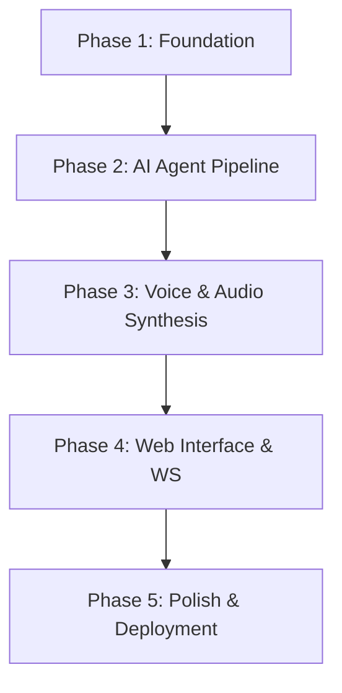

# 📋 Master Execution Plan: Doc-to-Podcast

This plan outlines the systematic development phases for building the **Doc-to-Podcast** application, which transforms any uploaded document into a natural, engaging conversation between two AI hosts.

---

## 🗺️ Execution Phases

### 🟩 Phase 1: Foundation (Current)
*   **Objectives:** Project structure setup, configuration module, Pydantic data schemas, custom exception classes, and multi-format document parser.
*   **Tasks:**
    *   [x] Set up project directory structure.
    *   [x] Create configuration management using `pydantic-settings` (`app/config.py`).
    *   [x] Implement robust Pydantic data models for themes, outlines, dialogue lines, and job tracking (`app/models.py`).
    *   [x] Build the fallback document parser (`app/parsers/document_parser.py`) supporting PDF, DOCX, TXT, HTML, etc.
*   **Deliverables:** Baseline repository structure with dependencies and deterministic document parsing engine.

### 🟨 Phase 2: AI Agent Pipeline
*   **Objectives:** Build LLM integration (Gemini primary, Groq fallback) and implement the 5-agent pipeline with a script review loop.
*   **Tasks:**
    *   [x] Implement LLM provider interfaces and client handlers (`app/llm/`).
    *   [x] Define detailed system prompts for Analyst, Outline, Writer, and Reviewer agents (`app/llm/prompts/`).
    *   [x] Implement `BaseAgent` and the 5 specialized agent classes under `app/agents/`.
    *   [x] Develop the `PipelineOrchestrator` to execute the sequence and handle the writer-reviewer correction loop.
*   **Deliverables:** Script generation engine capable of parsing files, outline drafting, script writing, and verification.

### 🟦 Phase 3: Voice & Audio Synthesis
*   **Objectives:** Implement speech synthesis and post-production audio mastering.
*   **Tasks:**
    *   [x] Implement `EdgeTTSProvider` using Microsoft Edge's neural voices (`app/tts/edge_tts_provider.py`).
    *   [x] Build the parallel `TTSManager` batch processor with emotion-based speed and pitch modulation (`app/tts/tts_engine.py`).
    *   [x] Build the `AudioProcessor` using PyDub for crossfading, silent pause insertion, and loudness normalization (`app/audio/processor.py`).
*   **Deliverables:** High-quality voice synthesis and stitching pipeline exporting a polished MP3.

### 🟪 Phase 4: Web Interface & Real-time Progress
*   **Objectives:** Create the FastAPI routes, WebSocket progress broadcaster, and responsive frontend UI.
*   **Tasks:**
    *   [x] Mount API routes and WebSocket endpoints in `app/main.py` and `app/api/`.
    *   [ ] Build the UI templates (`index.html`, `status.html`) with interactive drag-and-drop file uploaders.
    *   [ ] Connect frontend Javascript with the WebSocket endpoint for step-by-step progress tracking.
*   **Deliverables:** A fully functional browser-based user experience from file drop to audio playback.

### 🟥 Phase 5: Polish & Deployment
*   **Objectives:** Robust error recovery, comprehensive testing, Docker setup, and documentation.
*   **Tasks:**
    *   [ ] Write unit tests for parsers, agents, TTS, and stitching.
    *   [ ] Add docker files (`Dockerfile`, `docker-compose.yml`) for one-command deployment.
    *   [ ] Test scalability with extremely large documents (>100 pages).
*   **Deliverables:** A production-ready dockerized application.

---

## 🎯 Technical Decisions Rationale

| Core Challenge | Decision | Rationale |
|---|---|---|
| **LLM Context Limits** | Google Gemini 2.5 Flash | 1M token context allows processing massive documents in a single prompt without chunking, maintaining global coherence. |
| **TTS Licensing & Fees** | Microsoft Edge TTS | 100% free, high-fidelity neural voices, zero API key management required. |
| **Audio Manipulation** | PyDub + FFmpeg | Standard, lightweight, supports crossfading and precise millisecond pause padding. |
| **Task Execution** | FastAPI BackgroundTasks | In-process execution reduces infrastructure overhead (no Redis or worker setup required for local dev). |
